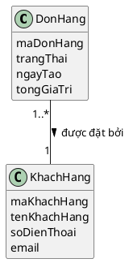
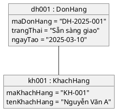
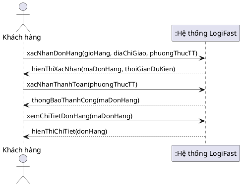
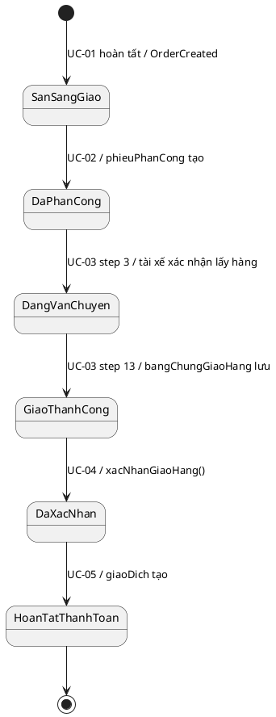
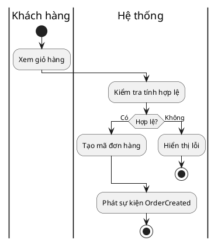

# PlantUML — OOAD Course Conventions

## General Setup
Always start with:
```plantuml
@startuml
skinparam classAttributeIconSize 0
skinparam style strictuml
hide empty members
```

## Domain Class Diagram (Part I — Analysis)



**Rules for Part I (domain model):**
- Attribute lines: name ONLY — NO `: Type` suffix
- NO `+`, `-`, `#` prefix on any attribute or method line
- NO method sections
- Use `--` for association (not `-->`)
- Include multiplicity at both ends: `"1..*"` and `"1"`
- Include association label with `>` or `<` for direction

## Design Class Diagram (Part II only)
```plantuml
class DonHang {
  - maDonHang: String
  - trangThai: TrangThaiDonHang
  - ngayTao: Date
  + getMaDonHang(): String
  + setTrangThai(t: TrangThaiDonHang): void
}
```

## Object Diagram

- Object format: `"instanceName : ClassName"` — underlined automatically
- Use concrete real values (no abstract placeholders)

## System Sequence Diagram (SSD)

- Only TWO participant boxes: the actor + `:Hệ thống LogiFast`
- NO Controller, Service, DAO, Repository participants
- Use Vietnamese method names with camelCase
- Each outgoing message from actor = one UC step
- Must have >2 messages from actor (outgoing arrows)

## State Machine Diagram

- Transition labels MUST reference UC step (e.g., `UC-03 step 5`) or SSD message name

## Activity Diagram (with swimlanes)

