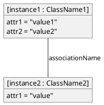
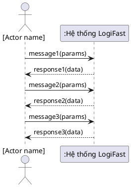
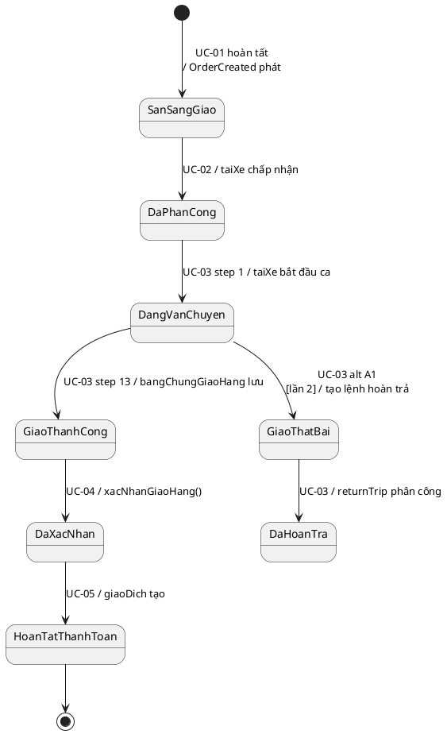
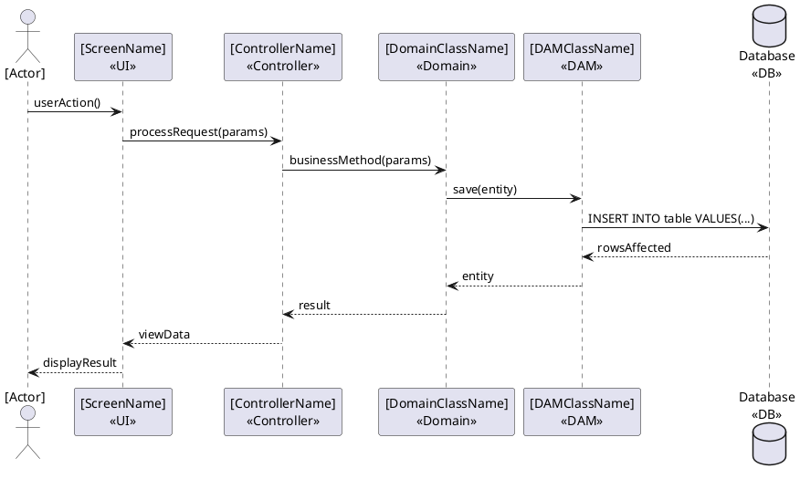

# Diagram Generation — LogiFast OOAD

Generate PlantUML diagrams for the LogiFast delivery management system.

## Usage

Specify:
1. **Diagram type**: class / object / ssd / state-machine / activity / sequence
2. **UC number**: UC-01 through UC-05 (or "all" for CRUD matrix)
3. **Phase**: analysis (Part I) or design (Part II)

---

## Template Library

### Class Diagram — Analysis (Part I)
```plantuml
@startuml UC-XX Domain Class Diagram
skinparam classAttributeIconSize 0
hide empty members
skinparam style strictuml

class [ClassName1] {
  attr1
  attr2
  attr3
}

class [ClassName2] {
  attr1
  attr2
}

[ClassName1] "1" -- "0..*" [ClassName2] : "associationName >"
@enduml
```

### Object Diagram


### SSD


### State Machine (DonHang lifecycle)


### Real-level Sequence (Part II Design)


---

## Output Instructions

1. Generate the PlantUML code block
2. State the file save path: `Project/Diagrams/UC-XX_[Type].puml`
3. List any grading rules applied (from `docs/grading-rubric.md`)
4. Flag any assumptions made about the UC flow
