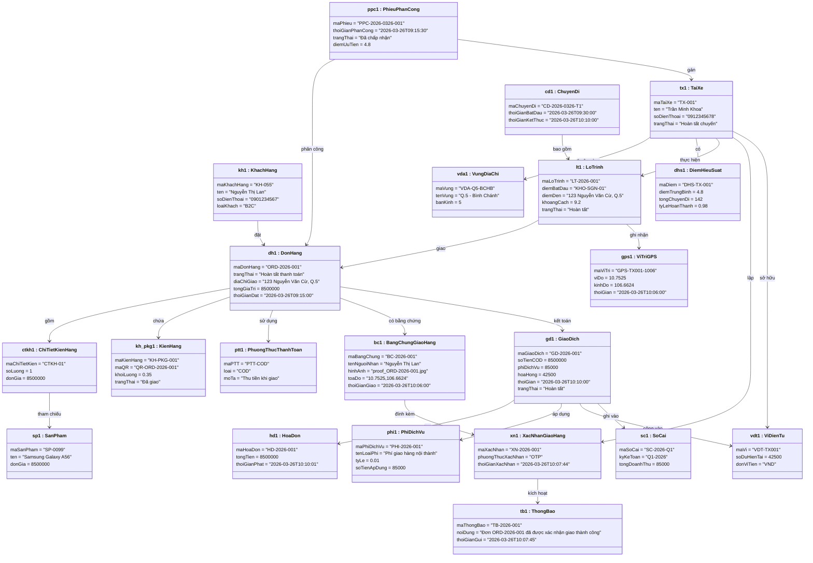

# Chương 4 — Mô hình hóa cấu trúc

## 4.1 Giới thiệu

Mô hình hóa cấu trúc xác định các **khái niệm nghiệp vụ cốt lõi** của hệ thống — những đối tượng tồn tại trong không gian vấn đề, thuộc tính đặc trưng và các mối quan hệ giữa chúng. Kết quả của chương này là nền tảng cho toàn bộ quá trình thiết kế chi tiết ở Phần II.

Trong phạm vi Phần I (giai đoạn phân tích), mô hình cấu trúc được xây dựng ở **mức lĩnh vực** (domain level): tập trung vào ý nghĩa nghiệp vụ, chưa gắn với bất kỳ công nghệ hay nền tảng triển khai cụ thể nào.

## 4.2 Quy trình và kỹ thuật mô hình hóa cấu trúc

> **Sub-rubric nội bộ** — Chiết xuất từ *20222-Ch03-MoHinhHoaCauTruc.pptx* (TS. Nguyễn Bá Ngọc).
> Mỗi bước dưới đây phải được thực hiện đủ trước khi bước tiếp theo bắt đầu. Kết quả cuối là sơ đồ đối tượng tổng quan ở Mục 4.2.5.

---

### 4.2.0 Sub-rubric: Tiêu chí chất lượng mô hình lĩnh vực

| # | Tiêu chí | Nguồn (slide) | Kiểm tra |
|---|----------|---------------|----------|
| R1 | Tất cả danh từ đã được liệt kê từ đặc tả UC | Slide 11 | Danh sách danh từ thô ≥ 30 mục |
| R2 | Mỗi danh từ được phân loại: *đối tượng / thuộc tính / ngoài phạm vi / trùng lặp* | Slide 12–13 | Bảng phân loại đầy đủ |
| R3 | Câu hỏi "Hệ thống có cần ghi nhớ thứ này không?" được trả lời cho MỌI danh từ | Slide 12 | Không có danh từ nào bị bỏ qua |
| R4 | Các lớp lĩnh vực được xác định từ danh từ phân loại "đối tượng" | Slide 6, 12 | Danh sách lớp ứng viên ≠ rỗng |
| R5 | Đối tượng cụ thể được dựng từ kịch bản UC (không phải lý thuyết) | Slide 38–40 | Mỗi UC ≥ 1 kịch bản với giá trị thực |
| R6 | **Thuộc tính: chỉ ghi tên, KHÔNG có `:Type`** (quy tắc phân tích I.12) | Slide 19 | Không có `: String`, `: int`, v.v. |
| R7 | Mọi quan hệ có tên + cơ số ở CẢ HAI đầu | Slide 28–29 | Không quan hệ nào thiếu cơ số |
| R8 | Sơ đồ đối tượng nhất quán với sơ đồ lớp (đối tượng thỏa ràng buộc) | Slide 38 | Mỗi liên kết đối tượng ↔ quan hệ lớp |
| R9 | Không có lớp giao diện đồ họa (Controller, DAO, v.v.) trong mô hình lĩnh vực | Slide 6 | Chỉ có lớp nghiệp vụ |
| R10 | SSD chỉ có Actor + :System, mọi thông điệp gắn với bước UC | Slide 15 rubric | >2 thông điệp/SSD |

---

### 4.2.1 Bước 1 — Kỹ thuật danh từ (Noun Technique)

**Nguyên tắc** *(Slide 9–12)*:
Đọc toàn bộ đặc tả luồng sự kiện chính + phụ của 5 UC, gạch chân **mọi danh từ** — kể cả những thứ có vẻ không quan trọng. Danh từ có thể là tên đối tượng, tên lớp, hoặc tên thuộc tính.

**Nguồn dữ liệu nhóm sử dụng**:
- Đặc tả 5 UC (luồng sự kiện chi tiết, tiền/hậu điều kiện) — Chương 2, Ricons.docx
- Các biểu mẫu nghiệp vụ hiện tại của LogiFast (phiếu xuất kho, hóa đơn COD, bảng điểm tài xế)
- Phỏng vấn điều phối viên và tài xế (ghi chép trong `docs/environment.md`)

**Danh sách danh từ thô — trích từ 5 UC LogiFast**:

| STT | Danh từ thô | Xuất hiện trong |
|-----|-------------|-----------------|
| 1 | Khách hàng | UC-01, UC-04 |
| 2 | Đơn hàng | UC-01, UC-02, UC-03, UC-04, UC-05 |
| 3 | Giỏ hàng | UC-01 |
| 4 | Sản phẩm / mặt hàng | UC-01 |
| 5 | Kiện hàng | UC-01, UC-03 |
| 6 | Địa chỉ giao hàng | UC-01 |
| 7 | Phương thức thanh toán | UC-01, UC-05 |
| 8 | Mã đơn hàng | UC-01, UC-04 |
| 9 | Trang xác nhận | UC-01 |
| 10 | Thời gian giao dự kiến | UC-01, UC-03 |
| 11 | Tài xế | UC-02, UC-03 |
| 12 | Phiếu phân công | UC-02 |
| 13 | Vùng địa chỉ | UC-02 |
| 14 | Điểm hiệu suất | UC-02 |
| 15 | Bán kính | UC-02 |
| 16 | Kho hàng | UC-02, UC-03 |
| 17 | Lộ trình | UC-03 |
| 18 | Vị trí GPS | UC-03 |
| 19 | Mã QR | UC-03 |
| 20 | Chuyến đi | UC-03 |
| 21 | Bằng chứng giao hàng | UC-03, UC-04 |
| 22 | Ảnh chụp | UC-03, UC-04 |
| 23 | Tên người nhận | UC-03, UC-04 |
| 24 | Shipper | UC-04 |
| 25 | Xác nhận giao hàng | UC-04 |
| 26 | Chữ ký điện tử / OTP | UC-04 |
| 27 | Thông báo | UC-04 |
| 28 | Giao dịch | UC-05 |
| 29 | Hóa đơn | UC-05 |
| 30 | Ví điện tử | UC-05 |
| 31 | Sổ cái | UC-05 |
| 32 | Phí dịch vụ | UC-05 |
| 33 | Hoa hồng tài xế | UC-05 |
| 34 | Hệ thống | tất cả UC |
| 35 | Ứng dụng | tất cả UC |
| 36 | Quản lý / Điều phối viên | UC-02 |

---

### 4.2.2 Bước 2 — Phân loại danh từ

**Bộ câu hỏi quyết định** *(Slide 12)*:

| Câu hỏi | Nếu "Có" → | Nếu "Không" → |
|---------|-----------|--------------|
| Danh từ có nằm trong phạm vi hệ thống LogiFast? | Giữ lại xét tiếp | **Loại bỏ** (ngoài phạm vi) |
| Hệ thống cần ghi nhớ nhiều hơn 1 đối tượng loại này? | Đây là **lớp** ứng viên | Có thể là **hằng số / cấu hình** |
| Nó là thành phần của thứ khác đã xác định? | Đây là **thuộc tính** | Giữ như lớp độc lập |
| Nó là đồng nghĩa với thứ khác đã xác định? | **Loại bỏ / gộp** | Tiếp tục xét |
| Nó chỉ là đầu ra được tính từ dữ liệu khác? | **Thuộc tính suy diễn** (`/tên`) | Giữ như thuộc tính thường |

**Bảng phân loại LogiFast**:

| Danh từ thô | Phân loại | Ghi chú / Kết quả |
|-------------|-----------|-------------------|
| Khách hàng | **Lớp** | `KhachHang` — B2C và API B2B |
| Đơn hàng | **Lớp** | `DonHang` — trung tâm toàn bộ quy trình |
| Giỏ hàng | Ngoài phạm vi | LogiFast không quản lý giỏ hàng — thuộc hệ thống đối tác |
| Sản phẩm / mặt hàng | **Lớp** | `SanPham` — cần ghi nhớ để tính phí |
| Kiện hàng | **Lớp** | `KienHang` — đơn vị vật lý được vận chuyển |
| Địa chỉ giao hàng | **Thuộc tính** | `diaChiGiao` trong `DonHang` (đơn trị) |
| Phương thức thanh toán | **Lớp** | `PhuongThucThanhToan` — có nhiều loại (COD, prepaid, B2B credit) |
| Mã đơn hàng | **Thuộc tính** | `maDonHang` trong `DonHang` — khóa định danh |
| Trang xác nhận | Ngoài phạm vi | Thành phần UI, không phải lớp lĩnh vực |
| Thời gian giao dự kiến | **Thuộc tính suy diễn** | `/thoiGianDuKien` trong `LoTrinh` |
| Tài xế | **Lớp** | `TaiXe` — agent vận chuyển |
| Phiếu phân công | **Lớp** | `PhieuPhanCong` — lớp liên kết DonHang ↔ TaiXe |
| Vùng địa chỉ | **Lớp** | `VungDiaChi` — dùng trong thuật toán phân công |
| Điểm hiệu suất | **Lớp** | `DiemHieuSuat` — gắn với TaiXe, cần lịch sử |
| Bán kính | **Thuộc tính** | `banKinhTimKiem` trong `VungDiaChi` |
| Kho hàng | **Thuộc tính** | `diemXuatPhat` trong `LoTrinh` (không cần lớp riêng trong phạm vi 5 UC) |
| Lộ trình | **Lớp** | `LoTrinh` — UC-03 phức tạp |
| Vị trí GPS | **Lớp** | `ViTriGPS` — cần lưu lịch sử chuỗi tọa độ |
| Mã QR | **Thuộc tính** | `maQR` trong `KienHang` |
| Chuyến đi | **Lớp** | `ChuyenDi` — bao gồm nhiều đơn trong 1 ca |
| Bằng chứng giao hàng | **Lớp** | `BangChungGiaoHang` — UC-03 + UC-04 dùng chung |
| Ảnh chụp | **Thuộc tính** | `hinhAnh` trong `BangChungGiaoHang` |
| Tên người nhận | **Thuộc tính** | `tenNguoiNhan` trong `BangChungGiaoHang` |
| Shipper | Đồng nghĩa | ≡ `TaiXe` trong phạm vi 5 UC (không tạo lớp riêng) |
| Xác nhận giao hàng | **Lớp** | `XacNhanGiaoHang` — hành động có dữ liệu cần ghi nhớ |
| OTP / Chữ ký điện tử | **Thuộc tính** | `phuongThucXacNhan` trong `XacNhanGiaoHang` |
| Thông báo | **Lớp** | `ThongBao` — UC-04 gửi đến nhiều bên |
| Giao dịch | **Lớp** | `GiaoDich` — UC-05 |
| Hóa đơn | **Lớp** | `HoaDon` — B2B credit, cần ghi nhớ riêng |
| Ví điện tử | **Lớp** | `ViDienTu` — thuộc TaiXe |
| Sổ cái | **Lớp** | `SoCai` — ghi nhận doanh thu tổng |
| Phí dịch vụ | **Lớp** | `PhiDichVu` — loại phí có cấu trúc riêng |
| Hoa hồng tài xế | **Thuộc tính suy diễn** | `/hoaHong` trong `GiaoDich` |
| Hệ thống | Loại bỏ | Quá chung, không phải lớp lĩnh vực |
| Ứng dụng | Loại bỏ | Thành phần UI |
| Quản lý / Điều phối viên | Loại bỏ | Actor — không ghi nhớ trong mô hình lĩnh vực |

**Kết quả**: **15 lớp lĩnh vực** được xác định, phân phối theo UC như Mục 4.3.

---

### 4.2.3 Bước 3 — Xây dựng các đối tượng (Object Instantiation)

**Nguyên tắc** *(Slide 38–40)*:
Với mỗi UC, xây dựng **một kịch bản cụ thể** với giá trị thực, sau đó tạo **đối tượng** (instance) cho mỗi lớp tham gia. Một đối tượng UML được ký hiệu `tênĐốiTượng : TênLớp` (gạch chân).

**Quy tắc xây dựng đối tượng**:
1. Mỗi đối tượng phải có **tên instance** + **tên lớp** (ví dụ: `dh1 : DonHang`)
2. Giá trị thuộc tính phải **cụ thể, thực tế** — không dùng "gia_tri_1", "abc"
3. Đối tượng xuất hiện trong nhiều UC (ví dụ `dh1`) phải có **cùng giá trị ID** xuyên suốt
4. Cơ số phải được thỏa mãn: nếu `DonHang "1" -- "1..*" KienHang` thì đối tượng `dh1` phải liên kết với ≥1 đối tượng `KienHang`

**Instance catalog — LogiFast happy path (2026-03-26)**:

| Đối tượng | Lớp | UC xuất hiện | ID mẫu |
|-----------|-----|-------------|--------|
| `kh1` | `KhachHang` | UC-01, UC-04 | KH-055 |
| `dh1` | `DonHang` | UC-01÷UC-05 | ORD-2026-001 |
| `sp1` | `SanPham` | UC-01 | SP-0099 |
| `ctkh1` | `ChiTietKienHang` | UC-01 | CTKH-01 |
| `ptt1` | `PhuongThucThanhToan` | UC-01, UC-05 | PTT-COD |
| `tx1` | `TaiXe` | UC-02, UC-03, UC-04 | TX-001 |
| `ppc1` | `PhieuPhanCong` | UC-02 | PPC-2026-0326-001 |
| `vda1` | `VungDiaChi` | UC-02 | VDA-Q5-BCHB |
| `dhs1` | `DiemHieuSuat` | UC-02 | DHS-TX-001 |
| `kh_pkg1` | `KienHang` | UC-01, UC-03 | KH-PKG-001 |
| `lt1` | `LoTrinh` | UC-03 | LT-2026-001 |
| `gps1` | `ViTriGPS` | UC-03 | GPS-TX001-1006 |
| `cd1` | `ChuyenDi` | UC-03 | CD-2026-0326-T1 |
| `bc1` | `BangChungGiaoHang` | UC-03, UC-04 | BC-2026-001 |
| `xn1` | `XacNhanGiaoHang` | UC-04 | XN-2026-001 |
| `tb1` | `ThongBao` | UC-04 | TB-2026-001 |
| `gd1` | `GiaoDich` | UC-05 | GD-2026-001 |
| `hd1` | `HoaDon` | UC-05 | HD-2026-001 |
| `vdt1` | `ViDienTu` | UC-05 | VDT-TX001 |
| `sc1` | `SoCai` | UC-05 | SC-2026-Q1 |
| `phi1` | `PhiDichVu` | UC-05 | PHI-2026-001 |

---

### 4.2.4 Bước 4 — Liên kết đối tượng (Object Linking)

**Nguyên tắc** *(Slide 17–19)*:
Từ kịch bản thực tế, xác định **liên kết** giữa các đối tượng bằng cách đọc động từ kết nối danh từ trong luồng sự kiện: "tài xế *nhận* đơn hàng", "đơn hàng *chứa* kiện hàng", v.v.

**Quy tắc liên kết**:
- Mỗi liên kết đối tượng (`link`) phải tương ứng với một **quan hệ** (`association`) trong sơ đồ lớp
- Nếu phát hiện liên kết đối tượng không có quan hệ lớp tương ứng → **bổ sung sơ đồ lớp**
- Cơ số quan hệ phải được thỏa mãn trong ví dụ đối tượng

**Ma trận liên kết đối tượng — happy path**:

| Từ | Đến | Tên liên kết | Nguồn (UC) |
|----|-----|-------------|-----------|
| `kh1` | `dh1` | đặt | UC-01 |
| `dh1` | `ctkh1` | gồm | UC-01 |
| `ctkh1` | `sp1` | tham chiếu | UC-01 |
| `dh1` | `ptt1` | sử dụng | UC-01 |
| `dh1` | `kh_pkg1` | chứa | UC-01, UC-03 |
| `ppc1` | `dh1` | phân công | UC-02 |
| `ppc1` | `tx1` | gán | UC-02 |
| `tx1` | `vda1` | thuộc | UC-02 |
| `tx1` | `dhs1` | có | UC-02 |
| `tx1` | `lt1` | thực hiện | UC-03 |
| `lt1` | `dh1` | giao | UC-03 |
| `lt1` | `gps1` | ghi nhận | UC-03 |
| `cd1` | `lt1` | bao gồm | UC-03 |
| `dh1` | `bc1` | có bằng chứng | UC-03, UC-04 |
| `bc1` | `xn1` | đính kèm | UC-04 |
| `tx1` | `xn1` | lập | UC-04 |
| `xn1` | `tb1` | kích hoạt | UC-04 |
| `dh1` | `gd1` | kết toán | UC-05 |
| `gd1` | `hd1` | tạo | UC-05 |
| `gd1` | `phi1` | áp dụng | UC-05 |
| `tx1` | `vdt1` | sở hữu | UC-05 |
| `gd1` | `vdt1` | cộng vào | UC-05 |
| `gd1` | `sc1` | ghi vào | UC-05 |

---

### 4.2.5 Sơ đồ đối tượng tổng quan — Happy Path LogiFast

> **Kịch bản**: Ngày 26/03/2026 — Chị Nguyễn Thị Lan (KH-055) đặt đơn ORD-2026-001 giao 1 kiện điện thoại; Tài xế Trần Minh Khoa (TX-001) nhận phân công, lấy hàng tại kho BìnhChánh, giao thành công lúc 10:06, xác nhận OTP, thanh toán COD hoàn tất lúc 10:10.

## 4.3 Mô hình hóa cấu trúc theo ca sử dụng

Chương được tổ chức thành 5 mục, mỗi mục tương ứng với một ca sử dụng và do một thành viên phụ trách:

| Mục | Ca sử dụng | Thành viên phụ trách |
|-----|-----------|----------------------|
| 4.3.1 | UC-01: Đặt đơn hàng | Trương Văn Hồng |
| 4.3.2 | UC-02: Phân công giao hàng | Nguyễn Quý Duy |
| 4.3.3 | UC-03: Vận chuyển đơn hàng | Phạm Gia Hưng |
| 4.3.4 | UC-04: Xác nhận giao hàng | Đinh Việt Hùng |
| 4.3.5 | UC-05: Giao hàng hoàn tất / Thanh toán | Nguyễn Ngọc Toàn |

Mỗi mục trình bày theo thứ tự:
1. Kịch bản sử dụng cụ thể (happy path)
2. Sơ đồ đối tượng minh họa kịch bản
3. Sơ đồ lớp lĩnh vực của UC
4. Sơ đồ tuần tự hệ thống (SSD)
5. Thẻ CRC cho các lớp chính trong UC
